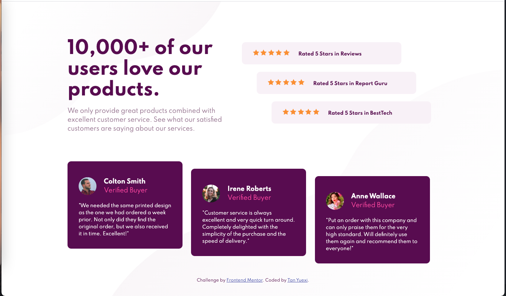

# Frontend Mentor - Social proof section solution

This is a solution to the [Social proof section challenge on Frontend Mentor](https://www.frontendmentor.io/challenges/social-proof-section-6e0qTv_bA). Frontend Mentor challenges help you improve your coding skills by building realistic projects.

## Table of contents

- [Overview](#overview)
  - [The challenge](#the-challenge)
  - [Screenshot](#screenshot)
  - [Links](#links)
- [My process](#my-process)
  - [Built with](#built-with)
  - [What I learned](#what-i-learned)
    - Content wrapping and background images
    - When shifting using `position: relative`, shift them inwards
    - Put sections side by side without Flex
  - [Continued development](#continued-development)


## Overview

### The challenge

Users should be able to:

- View the optimal layout for the section depending on their device's screen size

### Screenshot



### Links

- Solution URL: <https://github.com/tanyuexi/frontendmentor-social-proof-section-v1/>
- Live Site URL: <https://tanyuexi.github.io/frontendmentor-social-proof-section-v1/>

## My process

### Built with

- Semantic HTML5 markup
- CSS custom properties
- Mobile-first workflow


### What I learned

#### Content wrapping and background images

```CSS
body {
  position: relative;
  padding: 2rem;
}

div.bg-img {
  position: absolute;
  top: 0;
  left: 0;
}
```

#### When shifting using `position: relative`, shift them inwards

Align items to the outer edges, then shift them towards inside, that way can keep alignment neat:

```CSS
.rating-card__1 {
    position: relative;
    right: 80px;
  }

.rating-card__2 {
  position: relative;
  right: 40px;
}
```

#### Put sections side by side without Flex

Utilize `float` or `position: absolute`.

### Continued development

Try redo this in CSS Flex and Sass.
